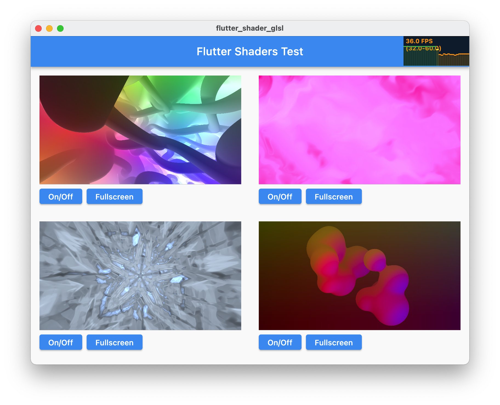

# Flutter-Shader-GLSL

## Overview
Flutter 3.4+ GLSL shaders 

## Preconditions

Flutter SDK 3.4 or later 
 Using [3.4.0-34.1.pre](https://storage.googleapis.com/flutter_infra_release/releases/beta/macos/flutter_macos_3.4.0-34.1.pre-beta.zip)
 Available Flutter SDK releases [here](https://docs.flutter.dev/development/tools/sdk/releases?tab=macos)
## UI

| Shader  | Path | Shadertoy`s link |
| -------  |---| --- |
|  | assets/shader_test_1.glsl | https://www.shadertoy.com/view/Ml2XRD |
|  | assets/shader_test_2.glsl | https://www.shadertoy.com/view/ftSSRR |
|  | assets/shader_test_3.glsl | https://www.shadertoy.com/view/ttKGDt |
|  | assets/shader_test_4.glsl | https://www.shadertoy.com/view/3sySRK |
